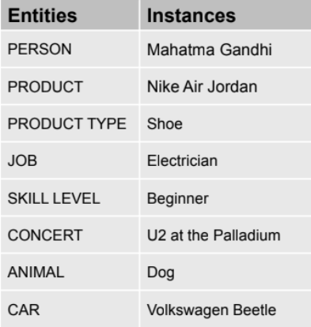
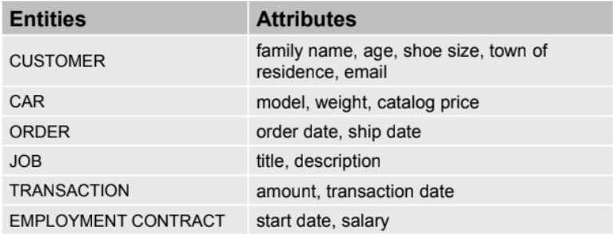

# SO2 L02 - ENTITIES, INSTANCES, ATTRIBUTES, AND IDENTIFIERS

 

<ul>
    <li style="list-style-type:disc;font-size:11pt;font-family:Arial,sans-serif;">
        
<strong>Entity&nbsp;</strong>- &ldquo;Something&rdquo; of significance to the business about which data must be known

        <ul>
            <li style="list-style-type:circle;font-size:11pt;font-family:Arial,sans-serif;">
                
A name for a set of similar things that you can list.&nbsp;

            </li>
            <li style="list-style-type:circle;font-size:11pt;font-family:Arial,sans-serif;">
                
Usually a noun

            </li>
            <li style="list-style-type:circle;font-size:11pt;font-family:Arial,sans-serif;">
                
Examples: objects, events, people

            </li>
        </ul>
    </li>
    <li style="list-style-type:disc;font-size:11pt;font-family:Arial,sans-serif;">
        
<strong>Instance&nbsp;</strong>- An instance is a single occurrence of an entity.

        <ul>
            <li style="list-style-type:circle;font-size:11pt;font-family:Arial,sans-serif;">
                
A Dalmatian, a Siamese cat, a cow and a pig are instances of ANIMAL entity.

            </li>
            <li style="list-style-type:circle;font-size:11pt;font-family:Arial,sans-serif;">
                
A convertible, a sedan and a station wagon are instances of CAR entity.

            </li>
            <li style="list-style-type:circle;font-size:11pt;font-family:Arial,sans-serif;">
                
Some entities have many instances and some have only a few

            </li>
        </ul>
    </li>
</ul>

<ul>
    <li style="list-style-type:disc;font-size:11pt;font-family:Arial,sans-serif;">
        
<strong>Attribute</strong>&nbsp;- Like an entity, an attribute represents something of significance to the business. An attribute is a specific piece of information that helps: 

    </li>
    <ul>
        <li style="list-style-type:circle;font-size:11pt;font-family:Arial,sans-serif;">
        
Attributes help you distinguish between one instance and another by providing greater detail for the entity.

        </li>
        <li style="list-style-type:circle;font-size:11pt;font-family:Arial,sans-serif;">
        
Describe an entity

        </li>
        <li style="list-style-type:circle;font-size:11pt;font-family:Arial,sans-serif;">
            
Quantify an entity

        </li>
        <li style="list-style-type:circle;font-size:11pt;font-family:Arial,sans-serif;">
            
Qualify an entity

        </li>
        <li style="list-style-type:circle;font-size:11pt;font-family:Arial,sans-serif;">
            
Classify an entity

        </li>
        <li style="list-style-type:circle;font-size:11pt;font-family:Arial,sans-serif;">
            
Specify an entity

        </li>
        <li style="list-style-type:circle;font-size:11pt;font-family:Arial,sans-serif;">
            
An attribute has a single value.

        </li>
    </ul>
</ul>

<ul>
    <li style="list-style-type:disc;font-size:11pt;font-family:Arial,sans-serif;">
        
Attributes have values. An attribute value can be a number, a character string, a date, an image, a sound, etc. These are called &quot;data types&quot; or &quot;formats.&quot; Every attribute stores one piece of data of one specific data type.

    </li>
    <li style="list-style-type:disc;font-size:11pt;font-family:Arial,sans-serif;">
        
Some attributes (such as age) have values that constantly change. These are called volatile attributes.

    </li>
    <li style="list-style-type:disc;font-size:11pt;font-family:Arial,sans-serif;">
        
Other attributes (such as order date) will rarely change, if ever. These are nonvolatile attributes.

    </li>
    <li style="list-style-type:disc;font-size:11pt;font-family:Arial,sans-serif;">
        
If given a choice, select the nonvolatile attribute. For example, use birth date instead of age.

    </li>
    <li style="list-style-type:disc;font-size:11pt;font-family:Arial,sans-serif;">
        
Some attributes must contain a value&mdash;these are mandatory attributes. For example: in most businesses that track personal information, name is required.

    </li>
    <li style="list-style-type:disc;font-size:11pt;font-family:Arial,sans-serif;">
        
Other attributes may either contain a value or be left null&mdash;these are optional attributes. For example: cellphone number is often optional except in mobile or wireless applications.

    </li>
    <li style="list-style-type:disc;font-size:11pt;font-family:Arial,sans-serif;">
        
<strong>Identifiers</strong>&nbsp;- Unique identifier (UID) is either a single attribute or a combination of multiple attributes that distinguishes one from another.

        <ul>
            <li style="list-style-type:circle;font-size:11pt;font-family:Arial,sans-serif;">
                
In a classroom, you need to distinguish between one student and another.

            </li>
            <li style="list-style-type:circle;font-size:11pt;font-family:Arial,sans-serif;">
                
When classifying your CD collection, you need to distinguish between one CD and another.

            </li>
        </ul>
    </li>
</ul>