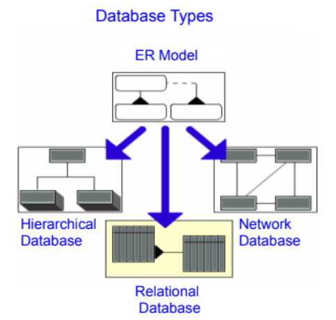
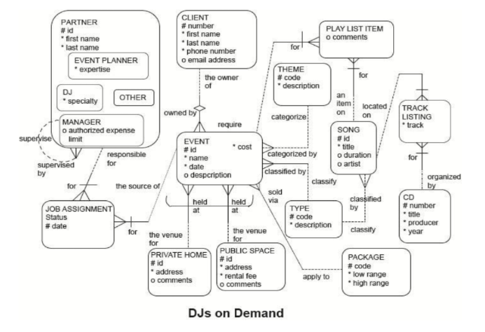

# SO2 L03 - ENTITY RELATIONSHIP DIAGRAM 
<ul>
    <li style="list-style-type:disc;font-size:11pt;font-family:Arial,sans-serif;">
        
<strong>Entity Relationship Diagram (ERD)&nbsp;</strong>- is a consistent tool that can be used to represent the data requirements of a business regardless of the type of database that is used, and even in the absence of one!

    </li>
</ul>

<ul>
    <li style="list-style-type:disc;font-size:11pt;font-family:Arial,sans-serif;">
        
<strong>Implementation-Free Models</strong>&nbsp;- A good conceptual data model stays the same regardless of the type of database the system is eventually built&mdash;or implemented&mdash;on. This is what we mean when we say that the model is &ldquo;implementation-free.&rdquo;

        <ul>
            <li>The data model should stay the same even if a database is not used at all. For example: when the data is eventually stored on pieces of paper in a filing cabinet.</li>
        </ul>
    </li>
</ul>

<ul>
    <li style="list-style-type:disc;font-size:11pt;font-family:Arial,sans-serif;">
        
<strong>What is an Entity Relationship Model</strong>

        <ul>
            <li style="list-style-type:disc;font-size:11pt;font-family:Arial,sans-serif;"> Is a list of all entities and attributes as well as all relationships between the entities that are of importance.
            </li>
            <li style="list-style-type:disc;font-size:11pt;font-family:Arial,sans-serif;">
                
Provides background information such as entity descriptions, data types, and constraints.

            </li>
            <li style="list-style-type:disc;font-size:11pt;font-family:Arial,sans-serif;">
                
Note: The model does not require a diagram, but the diagram is typically a very useful tool.

            </li>     
        </ul>
    </li>
</ul>

<li style="list-style-type:disc;font-size:11pt;font-family:Arial,sans-serif;">
    
<strong>Goals of ER Modelling</strong>

    <ol>
        <li style="list-style-type:decimal;font-size:11pt;font-family:Arial,sans-serif;">
            
Capture all required information

        </li>
        <li style="list-style-type:decimal;font-size:11pt;font-family:Arial,sans-serif;">
            
Ensure that information appears only once

        </li>
        <li style="list-style-type:decimal;font-size:11pt;font-family:Arial,sans-serif;">
            
Model no information that is derivable from other information already modeled

        </li>
        <li style="list-style-type:decimal;font-size:11pt;font-family:Arial,sans-serif;">
            
Locate information in a predictable, logical place

        </li>
    </ol>
</li>

