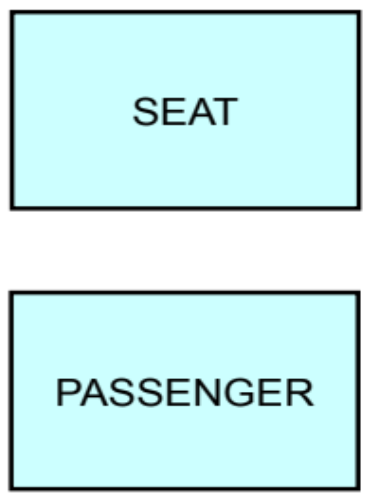
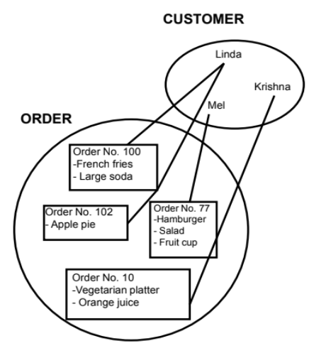

# SO3 L01 - IDENTIFYING RELATIONSHIPS

*   Being able to identify the relationships between entities makes it easier to understand the connections between different pieces of data.
    
*   Relationships help you see how different parts of a system affect each other. For example, the entities STUDENT and COURSE are related to each other.
    

### Relationships in Data Models

*   Relationships:
    

*   Represent something of significance or importance to the business
    
*   Show how entities are related to each other
    
*   Exist only between entities (or one entity and itself)
    
*   Are bi-directional
    
*   Are named at both ends
    
*   Have optionality
    
*   Have cardinality
    

*   <b>Cardinality</b> \- Cardinality measures the quantity of something. In a relationship, it determines the degree to which one entity is related to another by answering the question, “How many?”
    

For example:

*   How many jobs can one employee hold? One job only? Or more than one job?
    
*   How many employees can hold one specific job? One employee only? Or more than one employee?
    

Note: The cardinality of a relationship only answers whether the number is singular or plural; it does not answer with a specific plural number.

  

### Optionality and Cardinality

<b>Examples:</b>

Each EMPLOYEE must hold one and only one JOB

Each JOB may be held by one or more EMPLOYEEs

  

Each PRODUCT must be classified by one and only one PRODUCT TYPE

Each PRODUCT TYPE may classify one or more PRODUCTs

Relationships Example

Example 1

*   Each SEAT may be sold to one or more PASSENGERs
    
*   Each PASSENGER may purchase one SEAT
    
*   SEAT is sold to a PASSENGER (or PASSENGERs -- hence, overbooking)
    
*   PASSENGER purchases or books a SEAT
    

  
  
  

Example 2 

We consider the mother to be the customer who owns the order and is responsible for payment.

*   CUSTOMER has ORDERs: optionality and cardinality
    

<b>Optionality = Must or may?</b>

*   Each ORDER must be placed by one (and only one) CUSTOMER.
    
*   Each CUSTOMER must place one or more ORDERs.
    

<b>Cardinality = How many?</b>

*   Each ORDER must be placed by one (and only one) CUSTOMER.
    
*   Each CUSTOMER must place one or more ORDERs.