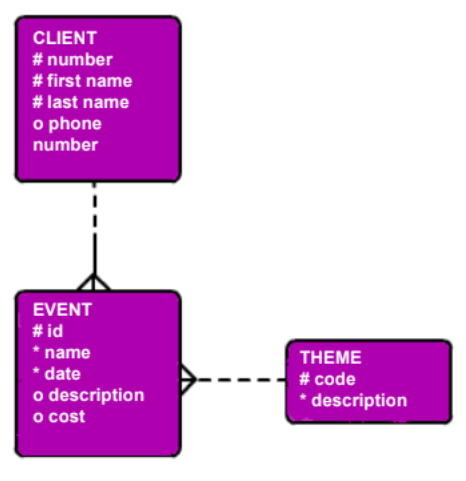
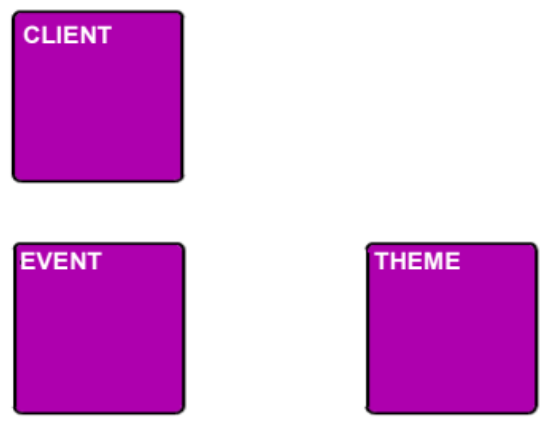
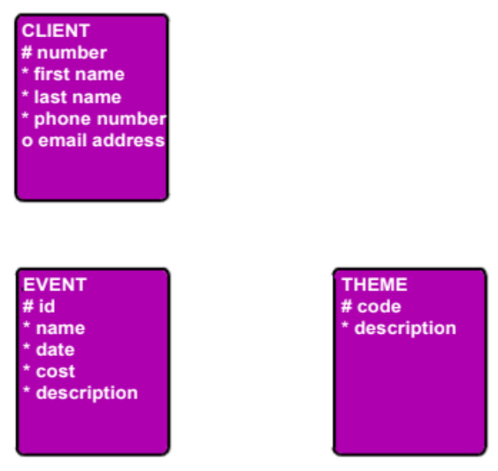
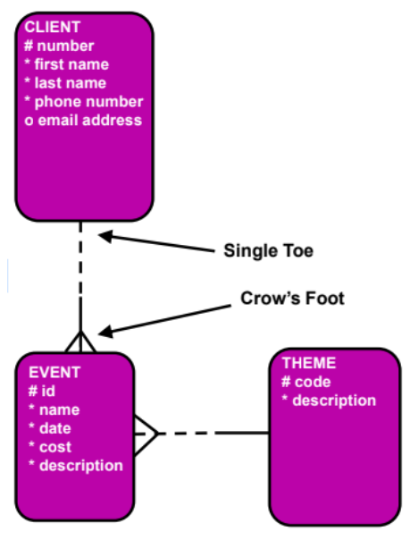

# SO3 L02 - ER DIAGRAMMING CONVENTIONS

DJs on Demand: CLIENTs, EVENTs, and TYPEs

"Our client list is growing. We have a lot of repeat business -- customers who like what we’ve done who ask us to work for them again. We have some very busy customers who can have more than one event going on at the same time.

Each partner has some specialty or expertise, so when it’s appropriate, we like to classify our events by theme to help us assign the right person (partner) to the job. An event theme can be a beach party, medieval, carnival, retro sixties or seventies, etc. We keep adding event themes as we go."

## ER Drawing Conventions

Entities

*   Entities are represented by softboxes.
    
*   Entity names go in the softboxes.
    
*   Entity names are always singular and written with all capital letters.
  

Attributes

*   Attributes are listed under the entity names.
    
*   Mandatory attributes are marked with an asterisk: “\*”
    
*   Optional attributes are marked with a circle: “o”
    
*   Unique identifiers are marked with a hash sign: “#”

  

Relationships

*   Relationships are lines that connect entities.
    
*   These lines are either solid or dashed.
    
*   These lines terminate in either a “single toe” or a “crow’s foot” at the end of each entity.