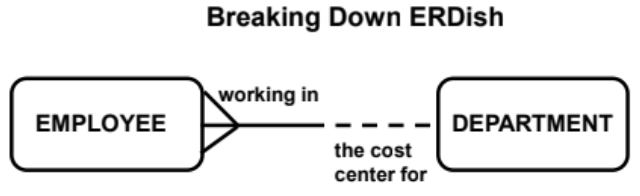
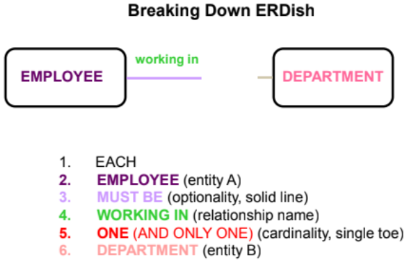
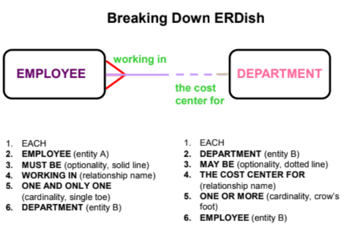

# SO3 L03 - SPEAKING ERDish & DRAWING RELATIONSHIPS

Data modeling uses industry-specific terminology as well, which we will call ERDish for the purposes of this class. ERDish—the vocabulary used to clearly communicate the business rules that are captured on an ERD—will give you a common language both when collecting the business rules from your client and communicating them to the Database Administrators who will implement your design.

*   ERDish is the language we use to state relationships between entities in an ERD.
    

1\. EACH

2\. Entity A

3\. OPTIONALITY (must be/may be)

4\. RELATIONSHIP NAME

5\. CARDINALITY (one and only one/one or more)

6\. Entity B

Since each relationship has two sides, we read the first relationship from left to right (or top to bottom,  depending on the ERD layout).

