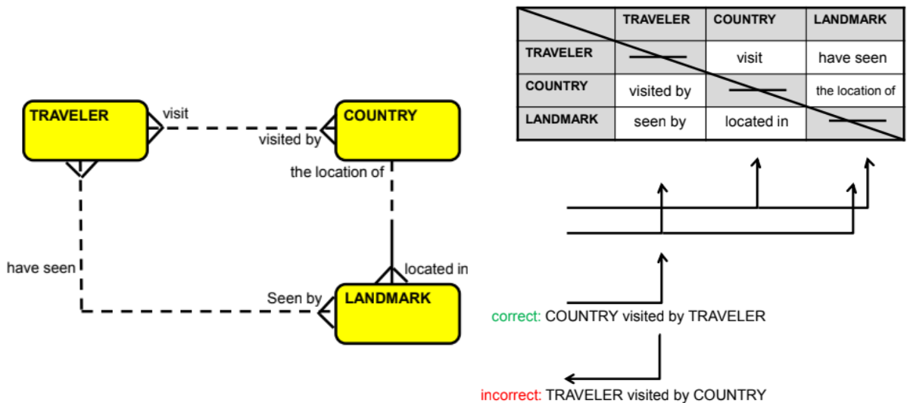

# SO3 L04 - MATRIX DIAGRAM

*   Using a matrix diagram, especially when you are dealing with many entities, is a good way to make sure that you haven’t missed any relationships.
    

Scenario

"I work for a travel agency. I keep a record of the countries that our customers have visited and the landmarks they’ve seen in each country. It helps us customize tours for them."

Relationships discovered via the matrix diagram are drawn on the ERD.

“Each COUNTRY may be visited by one or more TRAVELERs”.

To avoid confusion, be consistent in writing to and reading from the matrix only in one direction.