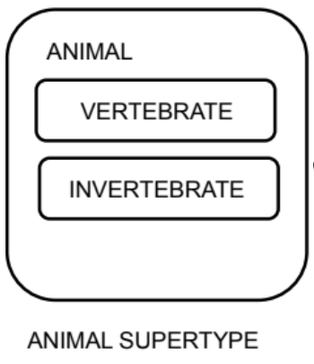
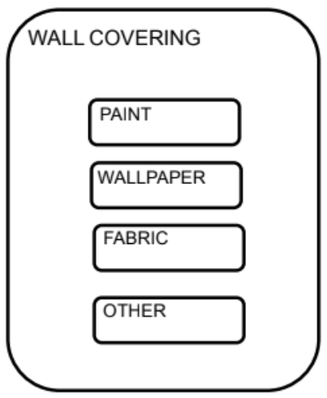
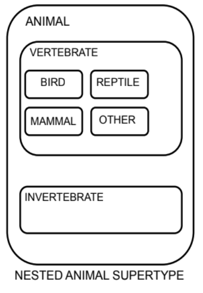

# S04 L01 - SUPERTYPES AND SUBTYPES

<b>Supertype</b> - A supertype is a general entity type that contains attributes common to several related subtypes.

<b>Subtype</b> - A subtype is a specialized entity that inherits attributes from the supertype but also has additional attributes specific to it.

Sometimes it makes sense to subdivide an entity into subtypes. This may be the case when a group of instances has special properties, such as attributes or relationships that exist only for that group. In this case, the entity is called a “supertype” and each group is called a “subtype”.

  

<b>Subtype:</b>

*   Inherits all attributes of the supertype
    
*   Inherits all relationships of the supertype
    
*   Usually has its own attributes or relationships
    
*   Is drawn within the supertype
    
*   Never exists alone
    
*   May have subtypes of its own
    
*   Is also known as a "subentity“
    

### Always More Than One Subtype

When an ER model is complete, subtypes never stand alone. In other words, if an entity has a subtype, a second subtype must also exist. This makes sense. A single subtype is exactly the same as the supertype. This idea leads to the two subtype rules:

*   Exhaustive: Every instance of the supertype is also an instance of one of the subtypes. All subtypes are listed without omission.
    
*   Mutually Exclusive: Each instance of a supertype is an instance of only one possible subtype.
    

<b> Wallcovering Supertype </b>

At the conceptual modeling stage, it is good practice to include an OTHER subtype to make sure that your subtypes are exhaustive -- that you are handling every instance of the supertype.

Any entity can be subtyped by making up a rule that subdivides the instances into groups.

But being able to subtype is not the issue—having a reason to

subtype is the issue. When a need exists within the business to show similarities and

differences between instances, then subtype.

### Correctly Identifying Subtypes

When modeling supertypes and subtypes, you can use three questions to see if the subtype is

correctly identified:

1.  Is this subtype a kind of supertype?
    
2.  Have I covered all possible cases? (exhaustive)
    
3.  Does each instance fit into one and only one subtype? (mutually exclusive)
    

## Nested Subtypes

You can nest subtypes. For ease of reading -- “readability” - - you would usually show subtypes with only two levels, but there is no rule that would stop you from going beyond two levels.