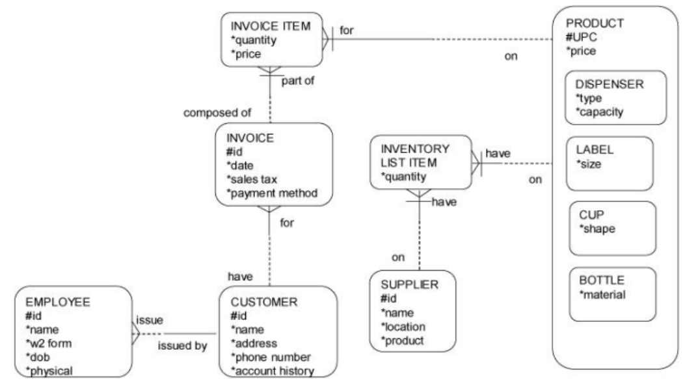
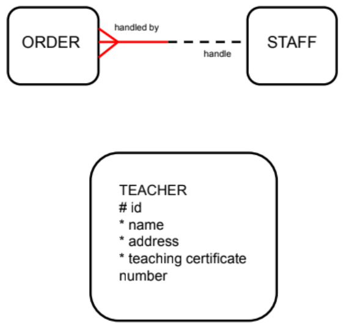

# S04 L02 - DOCUMENTING BUSINESS RULES

### Structural and Procedural Business Rules 

<b>Structural business rules</b> indicate the types of information to be stored and how the information elements interrelate.

<b> Procedural rules </b> deal with the prerequisites, steps, processes, or workflow requirements of a business. Many procedural business rules are related to time: event A must happen before event B.

* Structural business rules can nearly always be diagrammed in the ERD. Some procedural business rules cannot be diagrammed, but must still be documented so that they can be programmed later.

Structural business rules indicate the types of information to be stored and how the information elements interrelate. Here are a few examples:

All orders at a restaurant must be handled by a staff member (specifically, an order taker). There is no self-service ordering system.

All teachers at our school must possess a valid teaching certificate.

  

### Rule Discussion

Our school has many business rules that answer these questions:

*   Is it reasonable/effective for a class not to have a teacher assigned?
    
*   Is it reasonable/effective for two students to have the same student id number or no student id number at all?
    
*   Is it reasonable to schedule a teacher to teach a class if no students are enrolled?
    
*   Is it reasonable to allow someone to attend school if he is not enrolled in any classes?
    

### Documenting Rules

In the process of developing a conceptual data model, not all business rules can be modeled.

Some rules such as the two listed below must be implemented by programming the processes that interact with data:

1.  Any employee whose overtime exceeds 10 hours per week must be paid 1.5 times the hourly rate.
    
2.  Customers whose account balances are 90 days overdue will not be permitted to charge additional orders.